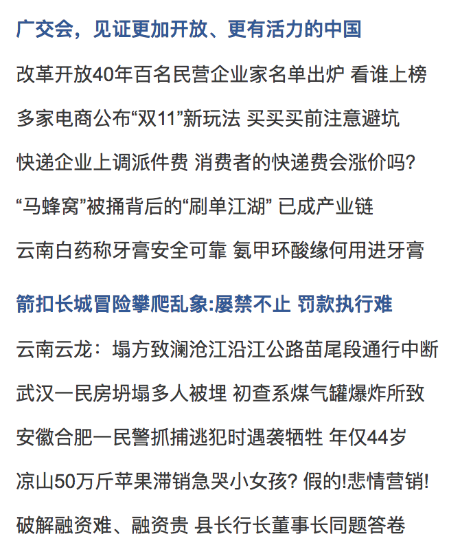
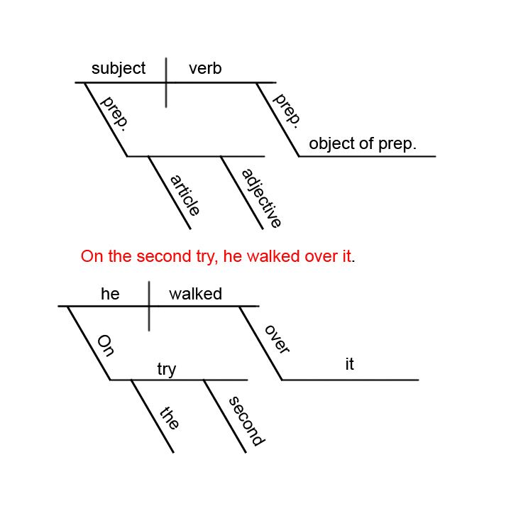
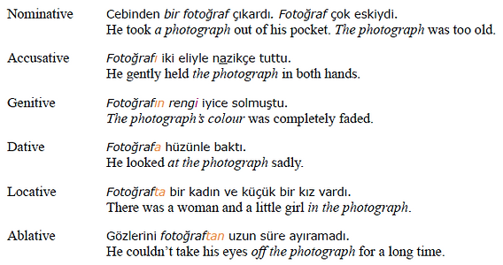
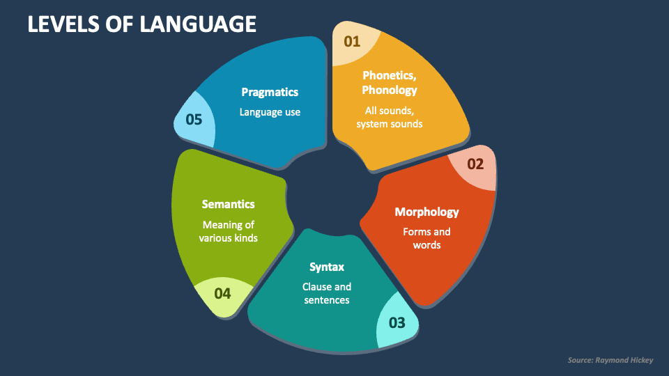
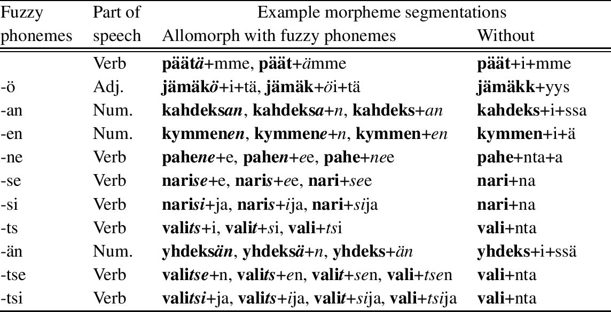
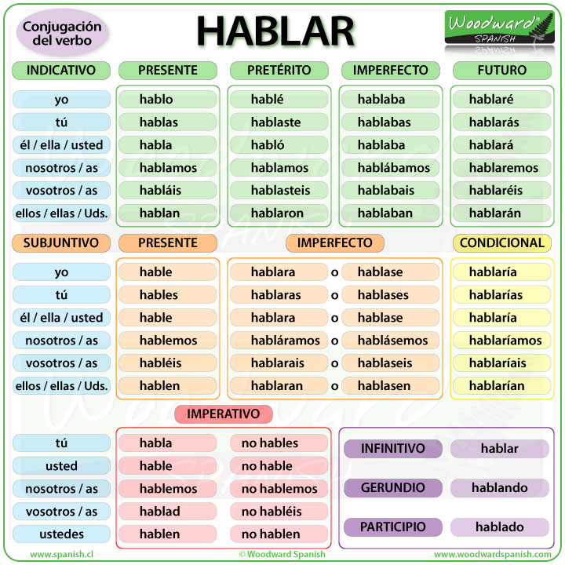
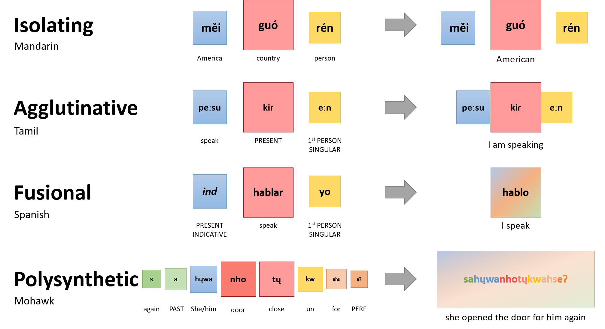
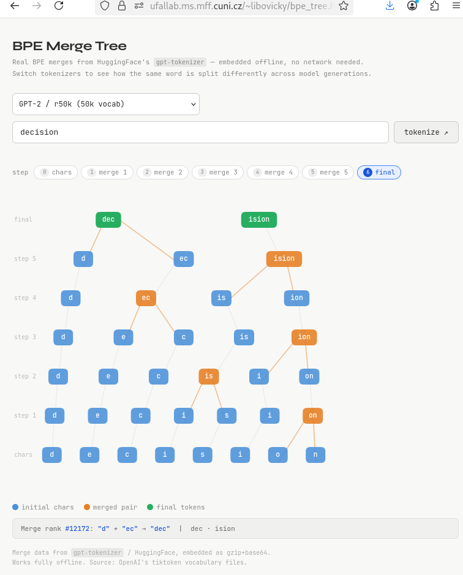

# 07 Tokenization (Libovický)

*Notes made by 'vok'*

Tokenizer Playground

https://huggingface.co/spaces/Xenova/the-tokenizer-playground

Anglicky efektivní. 

Česky ne moc, typos také špatné.

V němčině je mezi angličtinou a češtinou.

D s háčkem �� --- problematic.

---

### Why not to use words?

There is **too many** of them and they **are sparse.**

---

### Zipf’s Law and Morphology Type

**Velmi stručně:**

- **Izolační jazyky** – slova se **nemění**, gramatika = pořadí slov
   (např. Mandarin Chinese)
- **Aglutinační jazyky** – slovo = **řetězec přípon**, každá má **jednu funkci**
   (např. Turkish)
- **Flektivní (fusional)** – jedna koncovka nese **více významů najednou**
   (např. Czech)

**Shrnutí:**
 izolační = oddělené | aglutinační = skládané | flektivní = „slité“

---

What are differences Isolating Agglutinative Fusional language?

These are **types of morphological structure**—how languages build words and express grammar. The key difference is **how much information is packed into word forms and how clearly it’s separated**.

------

## 1) Isolating languages

|  |  |
| ------------------- | ----------------------------------------- |

**Core idea:** one word = one unit of meaning (no inflection)

- Words are usually **unchanged** (no endings, prefixes, etc.)
- Grammar is expressed by **word order** and **separate particles**
- Very little or no morphology

**Examples:**

- Mandarin Chinese
- Vietnamese

**Example concept:**

- “I go yesterday” → past is shown by a **separate word**, not verb change

------

## 2) Agglutinative languages

**Core idea:** words = base + many clear pieces (each piece = one meaning)

- Words are built by **adding suffixes/prefixes in a chain**
- Each affix has **one clear grammatical function**
- Boundaries between parts are usually **easy to see**

**Examples:**

- Turkish
- Finnish
- Japanese

**Example (Turkish):**

- *ev-ler-iniz-den*
  house + plural + your + from
  → “from your houses”

------

## 3) Fusional languages

|  |  |
| --------------------------------------------- | -------------------------------- |

**Core idea:** one ending = several meanings at once

- Affixes often encode **multiple grammatical categories simultaneously**
- Forms may be **irregular or fused**
- Harder to separate meanings cleanly

**Examples:**

- Latin
- Spanish
- Czech

**Example (Spanish):**

- *hablo* = speak + **1st person + singular + present**
  → all packed into **-o**

------

## Clean comparison

| Type          | Structure        | Meaning per piece       | Example |
| ------------- | ---------------- | ----------------------- | ------- |
| Isolating     | Separate words   | 1 word = 1 meaning      | Chinese |
| Agglutinative | Chain of affixes | 1 affix = 1 meaning     | Turkish |
| Fusional      | Fused endings    | 1 affix = many meanings | Czech   |

------

## Intuition (quick mental model)

- **Isolating** → LEGO pieces laid side by side
- **Agglutinative** → LEGO pieces snapped in a clean chain
- **Fusional** → pieces melted together into one block

------

If you want, I can place **English** or **Czech** precisely on this spectrum and show borderline cases (since most real languages are mixed).

---

### Morphology

Morphology ... basic units ... meaning .

Not by tokens.

There are some attempts to make tokenization smaller ... never helps.

To have it in one language ... not aware of that.

---

### Byte-pair Encoding

- Based on 1994 compression algorithm popularized by Sennrich et al., 2016 for MT
- Start with vocabulary **only containing characters**
- <u>Greedily</u> **merge the most frequent neighboring tokens** until we reach **the desired vocabulary**

---

### BPE Merge Tree

https://ufallab.ms.mff.cuni.cz/~libovicky/bpe_tree.html

Příklad tokenizace nějak.na základě velmi omezeného vstupního textu

---

### Demo time

https://ufallab.ms.mff.cuni.cz/~libovicky/bpe.html

---

### Unigram

Search for the most probable path in the graph.

### Tokenization vs. orthography

Tokenization vs. numbers

DeepSeek ... used special tokens for each digit 

Claude ... tries to encode keywords from programming languages as special tokens !!!!

### People talk about tokenizers…

strange artifacts taken as a token :-)

---

### Some models tokenizers

---

### Languages Are Different

Even if with balanced data, some languages will still have smaller units.

Why? 🤔

Reason is also the encoding... UTF..., or Latin ... have 4 bytes, encodes, ... there is simply some influence, I did not understand why. 

### Multilingual LLMs: Tokenization

Languages have slightly different script (even within a single family). It makes the data sparser then would be otherwise.

Beware of out-of-vocabulary tokens or [UNK]s 😨😨😨

UTF-8 (1)

UTF-8 (2)

Scripts can also be syllabic

### Glyph vs. grapheme (2)

Grapheme = abstract idea

Glyph = concrete realization

Be aware that different languages may have different looking "háček".

### Diacritics

**Arabic** & **Hebrew**: Diacritics is **optional**

- Special case: dot-less arabics

**Vietnamese**, **Turkish**: often omitted in informal/social media context

Both leads to oversegmentaiton compared to standard data.

The universal
declaration of
human rights
in different
languages
tokenized
using
different
tokenizers.

More languages ... costs more money 

Multilingual LLMs: Tokenizatio

### In some countries, models are more expensive

Next week ... Libovický ... other issues ...